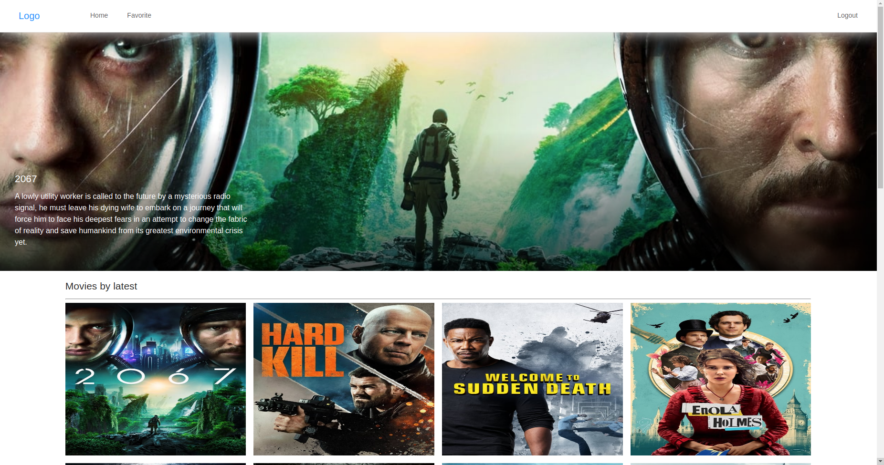

## Movie-app

영화정보가 담겨있는 open movie API를 이용하여 만든 간단한 영화소개앱.

## Preview

## Features

화면에 그리드 형식으로 영화포스터들을 뿌려주고, 포스터 클릭시 영화 상세화면으로 전환.

상세페이지에서 favorite버튼으로 영화를 favorite에 저장할 수 있고, Actor view를 통해 배우들의 프로필 사진을 그리드 형식으로 보여준다.

favorite veiw에선 내가 favorite추가한 영화들을 리스트로 한눈에 볼 수 있다.

## Reference

front는 react, react-redux, antd, http-proxy-middleware 등 여러 라이브러리로 구현했고,
back은 express 프레임워크를 사용하였고, DB는 mongoDB의 mongoose를 활용했다.
